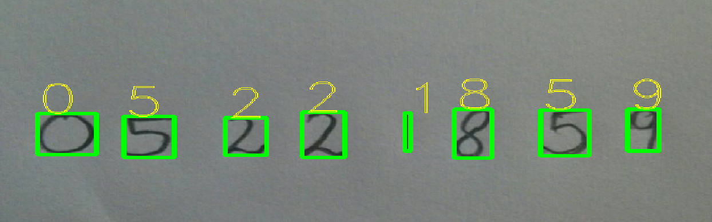
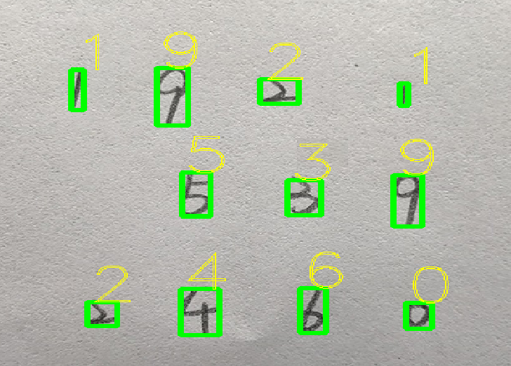

## Digit Recognition
Handwritten Digit Recognition using OpenCV, TensorFlow and Python.

### Dependencies
1. `cv2`
2. `tensorflow`
3. `numpy`

### Contents
This program contains the following files or folders:

1. `Mnist_data` - Mnist dataset.
2. `mnist_cnn.py` - Python program to get the cnn model with mnist dataset.
3. `mnist_sigmoid.py` - Python program to get the sigmoid model with mnist dataset.
4. `performRecognition.py` - Python program to perform recognition.
5. `photo_1.jpg` - Test image from Internet.
6. `photo_2.jpg` - Test image from Internet.
7. `photo_3.jpg` - Test image from yangyanli's git.
8. `photo_cdr1.jpg` - Test image writen by myself.
9. `Model_cnn` - CNN model file folder.
10. `Model_sigmoid` - Sigmoid model file folder.

### Usage 

- Clone the repository - 
```bash cd git clone https://github.com/daren996/digit-recognition.git```
- The next step is to get the model. Run the program `mnist_cnn.py` or `mnist_sigmoid.py`. It will produce the model in corresponding folders. I have already gotten the two models, so this step is not necessary.
- To perform recognition, run the `performRecognition.py` program.

### Results

#### Sample photo_1

#### Sample photo_cdr1



